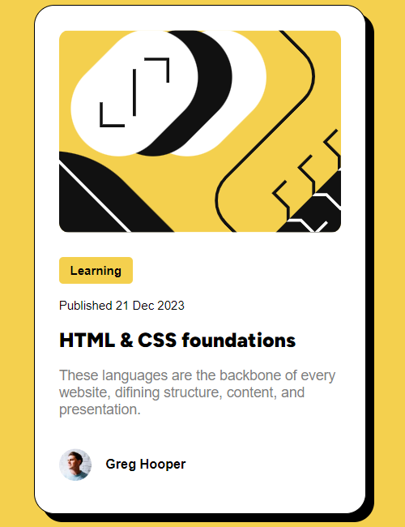

# Frontend Mentor - Blog preview card solution

This is a solution to the [Blog preview card challenge on Frontend Mentor](https://www.frontendmentor.io/challenges/blog-preview-card-ckPaj01IcS). Frontend Mentor challenges help you improve your coding skills by building realistic projects. 

## Table of contents

- [Overview](#overview)
  - [The challenge](#the-challenge)
  - [Screenshot](#screenshot)
  - [Links](#links)
- [My process](#my-process)
  - [Built with](#built-with)
  - [What I learned](#what-i-learned)
  - [Continued development](#continued-development)
  - [Useful resources](#useful-resources)
- [Author](#author)
- [Acknowledgments](#acknowledgments)

## Overview

This is my solution to the blog preview card by Frontend Mentor.

### The challenge

Users should be able to:

- See hover and focus states for all interactive elements on the page

### Screenshot



### Links

- Solution URL: [Add solution URL here](https://your-solution-url.com)
- Live Site URL: [Add live site URL here](https://your-live-site-url.com)

## My process

I used the Figma designs as a guideline. I started coding the sections from top to bottom, starting with the card image, goind down to the middle section with the tag, published date, title and description. Lastly, the footer with the author and their picture.

I used flexbox and grid to place things on the right position. I added a media query to adjust the card to mobile devices screen, making smaller after <800px of width.

### Built with

- Semantic HTML5 markup
- CSS custom properties
- Flexbox
- CSS Grid

### What I learned

I learned how to use flexbox and grid to create elements. Also, how to design elements from scatch, using a design as guideline. I also learned how to use the 'hover' function.

```css
.card {
      display: flex;
      flex-direction: column;
      background-color: #ffff;
      height: 522px;
      max-width: 384px;
      border-radius: 20px;
      margin: 0 auto;
      border: 1px solid black;
      box-shadow: 8px 8px;
      overflow: hidden;
    }

.category {
      font-size: 14px;
      font-weight: 700;
      width: 82px;
      height: 29px;
      border-radius: 4px;
      display: grid;
      place-items: center;
      justify-content: center;
      text-align: center;
      background-color: #F4D04E;
      margin: 0;
    }

 @media (max-width: 800px){
      .card {
        display: flex;
        max-width: 327px;
        height: 501px;
      }
 }
```

### Continued development

I want to keep working on creating elements from scratch with HTML and CSS, to then creating full (good looking)websites with HTML and CSS, and then learn JS to add reactivity.
